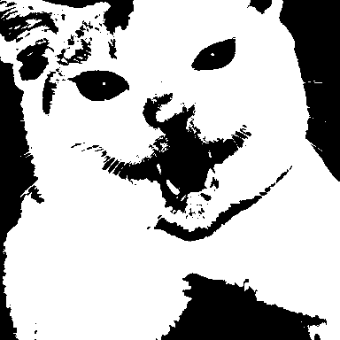
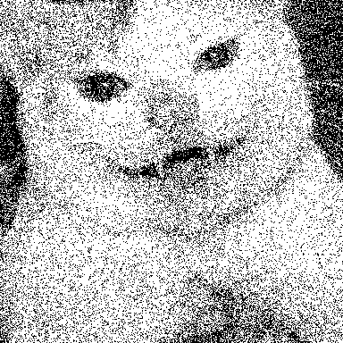
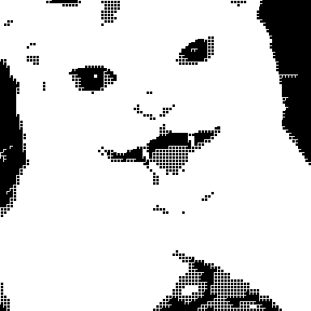
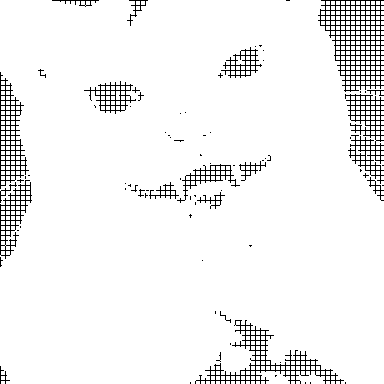

# Cat Printer SDK

The Cat Printer SDK is a powerful JavaScript library that brings the convenience of Bluetooth connectivity to your web applications. Connect to affordable portable mini thermal printers (commonly known as Cat Printers) to print text, images, and more programmatically without using the vendor's mobile app.

> ⚠️ **Warning:** This library has been tested only on select printer models. We highly recommend trying the [demo](https://opuu.github.io/cat-printer/) to verify compatibility before deploying in production.

## Features

- **Bluetooth Connectivity:** Easily connect to your thermal printer using Web Bluetooth.
- **Text Printing:** Customize font family, size, weight, alignment, and more for professional output.
- **Image Printing with Multiple Dithering Methods:** Convert images to black and white using various methods:
    - **Threshold:** Simple brightness cutoff.
    - **Bayer:** Uses an ordered Bayer matrix for a patterned effect.
    - **Floyd-Steinberg:** Implements error diffusion for smoother gradients.
    - **Random:** Applies a randomized threshold to achieve a textured result.
    - **Pixel, Dot & Box Dithering:** Additional techniques for more artistic or technical effects.
- **Printer Control:** Adjust print settings such as speed, energy, and paper feed.
- **State Monitoring:** Check printer conditions like paper status, cover position, temperature, battery level, and more.
- **Queue Support:** Manage and print multiple items in sequence to streamline your printing workflow.

## Installation

Get started in seconds by installing the Cat Printer SDK using your favorite package manager:

### NPM
```bash
npm install cat-printer
```

### Yarn
```bash
yarn add cat-printer
```

### PNPM
```bash
pnpm add cat-printer
```

### Bun
```bash
bun add cat-printer
```

## Quick Start

Below is a simple example demonstrating how to connect to a Cat Printer, print text and an image, and then gracefully disconnect.

```typescript
import { CatPrinter } from 'cat-printer';

// Create a new instance with debug logging enabled
const printer = new CatPrinter({ debug: true });

// Connect to the printer
async function connectPrinter() {
        try {
                await printer.connect();
                console.log('Connected to printer!');
                
                // Print text with custom options
                await printer.printText('Hello World!', { 
                        fontSize: 24, 
                        fontWeight: 'bold',
                        align: 'center',
                        lineSpacing: 8
                });
                
                // Print an image using Floyd-Steinberg dithering
                await printer.printImage('https://example.com/image.jpg', {
                        dither: 'floyd-steinberg'
                });
                
                // Feed the paper to finalize the printing job
                await printer.feed(100);
                
                // Disconnect when the job is done
                await printer.disconnect();
        } catch (error) {
                console.error('Error during printing:', error);
        }
}

// Bind the connect function to a button click event
document.getElementById('connectButton').addEventListener('click', connectPrinter);
```

## API Reference

### Class: CatPrinter

The `CatPrinter` class offers all methods needed to interact with a thermal printer via Bluetooth.

#### Constructor

```typescript
new CatPrinter(options?: PrinterOptions)
```

**PrinterOptions:**

| Option     | Type    | Default | Description                             |
|------------|---------|---------|-----------------------------------------|
| debug      | boolean | false   | Enable debug logging                    |
| speed      | number  | 32      | Default print speed                     |
| energy     | number  | 24000   | Default print energy/density            |
| finishFeed | number  | 100     | Default lines to feed after printing    |

### Methods

#### Connection Management

- **connect(): Promise<PrinterState>**  
    Connects to the printer via Bluetooth.

- **disconnect(): Promise<void>**  
    Disconnects from the printer.

- **isConnected(): boolean**  
    Returns the current connection status.

- **getState(): PrinterState**  
    Retrieves detailed printer state.

#### Printing Operations

- **printText(text: string, options?: TextOptions): Promise<void>**  
    Prints text with customizable formatting.

- **printImage(imageUrl: string, options?: ImageOptions): Promise<void>**  
    Prints an image using a specified dithering method.

- **printMultiple(items: Array<{type: 'text' | 'image', content: string, options?: TextOptions | ImageOptions}>): Promise<void>**  
    Prints multiple items in a queued sequence.

#### Paper Control

- **feed(lines: number): Promise<void>**  
    Advances the paper by the specified number of lines.

- **retract(lines: number): Promise<void>**  
    Retracts available paper by the given number of lines.

#### Printer Settings

- **setSpeed(speed: number): Promise<void>**  
    Adjusts the printing speed.

- **setEnergy(energy: number): Promise<void>**  
    Adjusts the print energy/density.

- **prepare(speed: number, energy: number): Promise<void>**  
    Sets up both speed and energy simultaneously.

- **finish(feed: number): Promise<void>**  
    Completes printing with a final paper feed.

### Options Types

#### TextOptions

| Option      | Type                                    | Description                              |
|-------------|-----------------------------------------|------------------------------------------|
| fontFamily  | string                                  | Font family for the text                 |
| fontSize    | number                                  | Font size in pixels                      |
| fontWeight  | string                                  | Font weight (e.g., 'normal', 'bold')       |
| align       | 'start' \| 'center' \| 'end' \| 'justified' | Text alignment                        |
| lineSpacing | number                                  | Line spacing in pixels                   |
| rotate      | number                                  | Rotation angle in degrees                |
| flipH       | boolean                                 | Flip text horizontally                   |
| flipV       | boolean                                 | Flip text vertically                     |
| brightness  | number                                  | Brightness threshold (0-255)             |
| offset      | number                                  | Optional paper feed/retract adjustment   |

#### ImageOptions

| Option     | Type                                                                       | Description                                      |
|------------|----------------------------------------------------------------------------|--------------------------------------------------|
| dither     | 'none' \| 'threshold' \| 'bayer' \| 'floyd-steinberg' \| 'random' \| 'pixel' \| 'dot' \| 'box'  | Dithering algorithm to convert images |
| rotate     | number                                                                     | Rotation angle in degrees                        |
| flipH      | boolean                                                                    | Flip the image horizontally                      |
| flipV      | boolean                                                                    | Flip the image vertically                        |
| brightness | number                                                                     | Brightness threshold (0-255)                     |
| offset     | number                                                                     | Paper feed/retract adjustment before printing    |

#### PrinterState

| Property   | Type    | Description                                  |
|------------|---------|----------------------------------------------|
| outOfPaper | boolean | True when the printer is out of paper        |
| coverOpen  | boolean | True when the printer's cover is open        |
| overheat   | boolean | True when the printer is overheated          |
| lowPower   | boolean | True when the battery is low                 |
| paused     | boolean | True when the printer is paused              |
| busy       | boolean | True when the printer is busy                |

## Dithering Options

When printing images, the SDK converts images to black and white using various dithering techniques. Each method offers a unique visual style and performance characteristics:

- **threshold:** Applies a simple brightness threshold.
- **bayer:** Uses an ordered Bayer matrix to generate a patterned effect.
- **floyd-steinberg:** Uses error diffusion for smooth gradient transitions.
- **random:** Introduces randomized noise to approximate various shading effects.
- **pixel, dot & box:** Additional techniques offering distinct stylistic results; ideal for creative outputs.

## Dithering Previews

Below are previews showcasing the visual effects of different dithering methods. (Note: Replace the image URLs with actual examples as needed.)

| Dithering Method      | Preview                                         |
|-----------------------|-------------------------------------------------|
| **None**             |        |
| **Threshold**         |      |
| **Bayer**             |            |
| **Floyd-Steinberg**   |  |
| **Random**            |            |
| **Pixel**             |              |
| **Dot**               |                |
| **Box**               |                |

## Browser Compatibility

The Cat Printer SDK leverages the Web Bluetooth API, which is currently supported in:

- Chrome
- Edge
- Opera

Please note that Safari and Firefox do not offer native support for the Web Bluetooth API, all chromium-based browsers should work fine.

## Contributing

We welcome contributions! If you have suggestions, bug reports, or feature requests, please open an issue or submit a pull request.

## Supported Printers

- [x] GB01
- [x] GB02
- [x] GB03
- [x] GT01
- [x] YT01
- [x] MX05
- [x] MX06
- [x] MX08
- [x] MX10
- [x] X5

## Inspired By

- [NaitLee/Cat-Printer](https://github.com/NaitLee/Cat-Printer/)
- [NaitLee/kitty-printer](https://github.com/NaitLee/kitty-printer)

## License

Distributed under the AGPL-3.0 license. See the LICENSE file for details.